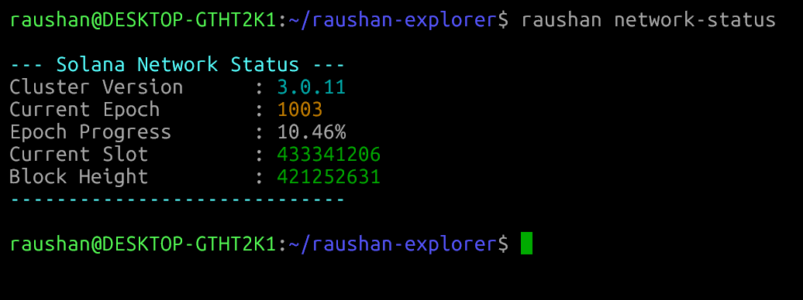
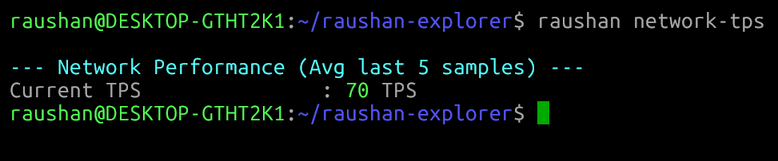
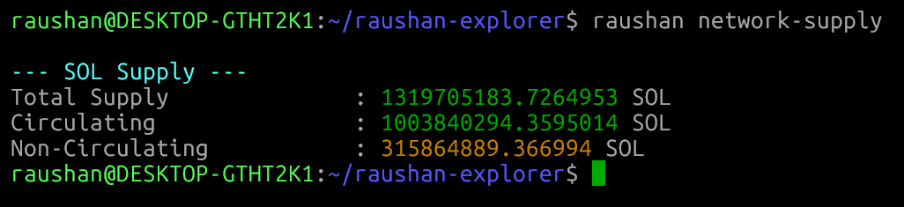
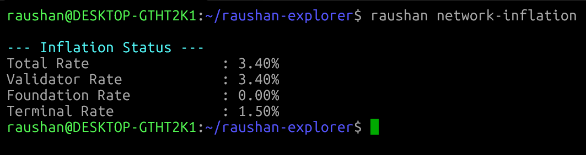
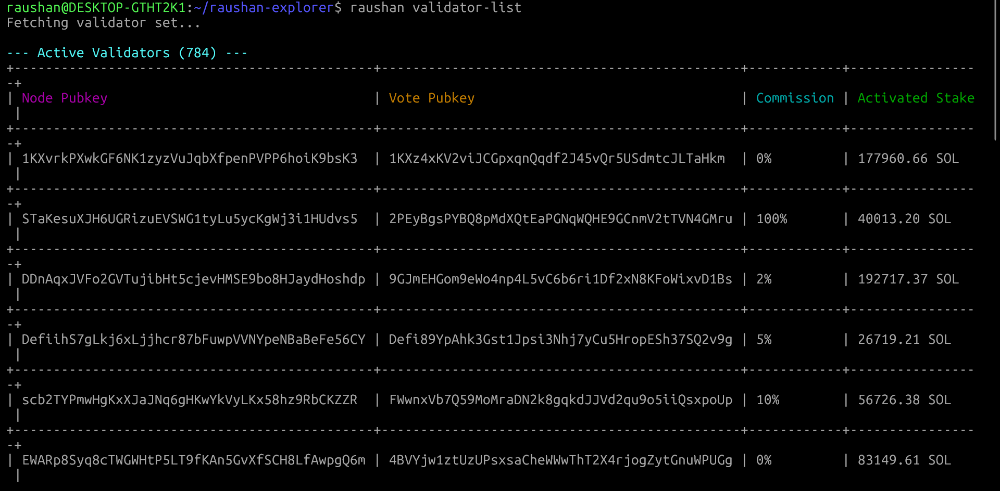
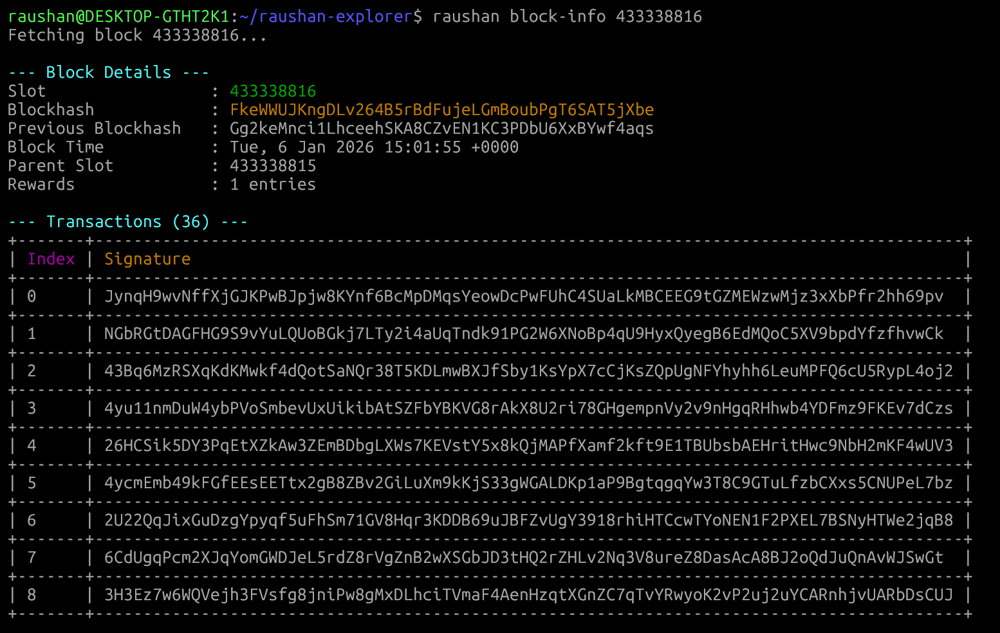
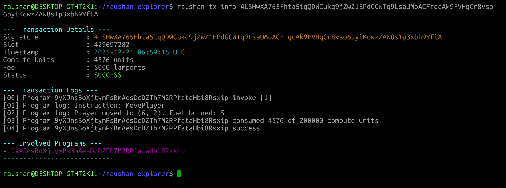
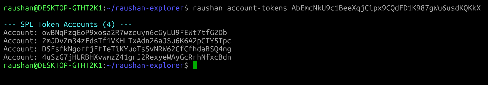
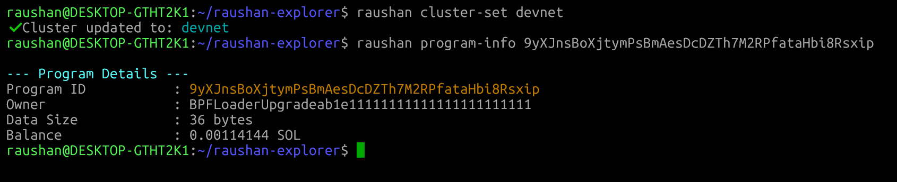

# Raushan Explorer CLI: The Ultimate Terminal-Based Solana Blockchain Explorer

**Raushan Explorer** is a production-grade, high-performance command-line interface (CLI) tool designed to provide deep introspection capabilities for the Solana blockchain directly from your terminal.

---

## Table of Contents

- [Introduction](#introduction)
- [Key Features](#key-features)
- [System Architecture](#system-architecture)
- [Prerequisites](#prerequisites)
- [Installation](#installation)
- [Configuration](#configuration)
- [Command Reference](#command-reference)
- [Visual Walkthrough](#visual-walkthrough)
- [Troubleshooting](#troubleshooting)
- [License](#license)
- [Connect with Me](#connect-with-me)

---

## Introduction

Raushan Explorer bridges the gap between complex blockchain data and developer efficiency. By replacing the need for slow, web-based block explorers, it offers developers, auditors, and node operators instant access to the Solana network's state. With over 30+ deep-inspection commands, users can query blocks, transactions, accounts, tokens, and validators with zero latency context switching.

## Key Features

- **Cluster Management**: Robust persistence system for managing connections to Devnet, Testnet, and Mainnet-Beta.
- **Real-time Network Performance**: Monitor critical metrics such as Transactions Per Second (TPS), inflation rates, and total supply in real-time.
- **Advanced Transaction Debugging**: Decode transaction signatures to view status, fees, execution logs, and inner instructions.
- **Deep Account & Token Audits**: Instantly inspect SPL Token balances, recursive ownership, and Stake account activation states.
- **Global Validator Dashboard**: detailed views of the active validator set helping to monitor network health and decentralization.

---

## Prerequisites

**For Installation Method 1 (Direct Binary - Recommended):**

- **Operating System**: Linux or macOS.
- **Dependencies**: `curl` and `bash`.
- **Note**: Rust/Cargo is **NOT** required for this method.

**For Installation Method 2 (From Source):**

- **Rust Toolchain**: Rust 1.75 or newer.
- **Cargo**: Standard package manager for Rust.

---

## Installation

### Method 1: Direct Binary Download (Fastest)

This method downloads the pre-compiled binary directly from GitHub Releases. It is the fastest way to get started and does not require a Rust environment.

```bash
curl -sSfL https://raw.githubusercontent.com/raushan728/solana-explorer-cli/main/install.sh | bash
```

### Method 2: Build from Source

This method is intended for developers who wish to modify the source code or compile specifically for their architecture. It requires the Rust toolchain to be installed.

```bash
cargo install --git https://github.com/raushan728/solana-explorer-cli
```

If you prefer to manually manage the source code:

```bash
# 1. Clone the repository
git clone https://github.com/raushan728/solana-explorer-cli.git
cd solana-explorer-cli

# 2. Build and Install
cargo install --path .
```

---

## System Architecture

Raushan Explorer is built using **Rust (2024 Edition)**, leveraging its memory safety and zero-cost abstractions to deliver blazing fast performance.

- **Asynchronous Core**: Powered by the `tokio` runtime, enabling concurrent RPC requests without blocking the UI thread.
- **Persistent Configuration**: State is managed via a JSON configuration file located at `~/.raushan_config.json`, ensuring your cluster preferences persist across sessions.
- **Modular Design**: The codebase is architected with a strictly hierarchical command structure, allowing for easy extensibility and maintenance.

---

## Command Reference

The CLI allows for intuitive navigation through standardized kebab-case commands.

### Network & Cluster

| Category    | Command              | Description                                                                       |
| :---------- | :------------------- | :-------------------------------------------------------------------------------- |
| **Cluster** | `cluster-set <NAME>` | Switch active cluster (e.g., `mainnet`, `testnet`, `devnet`). Persists to config. |
| **Cluster** | `cluster-get`        | View the currently configured cluster and RPC URL.                                |
| **Cluster** | `cluster-info`       | Display Solana Core version and feature set.                                      |
| **Cluster** | `cluster-health`     | Perform a health check on the currently connected node.                           |
| **Cluster** | `cluster-nodes`      | List known nodes in the gossip network.                                           |
| **Network** | `network-status`     | Dashboard view of Epoch, Slot, Block Height, and Progress.                        |
| **Network** | `network-tps`        | Real-time Transactions Per Second (TPS) calculator.                               |
| **Network** | `network-supply`     | View Total, Circulating, and Non-Circulating SOL supply.                          |
| **Network** | `network-inflation`  | Current inflation schedule and rates.                                             |
| **Network** | `network-epoch-info` | Detailed schedule of the current Epoch.                                           |

### Accounts & Assets

| Category    | Command                        | Description                                              |
| :---------- | :----------------------------- | :------------------------------------------------------- |
| **Account** | `account-info <ADDRESS>`       | View Balance, Owner, Data Size, and Executable status.   |
| **Account** | `account-tokens <ADDRESS>`     | List all SPL Token accounts owned by an address.         |
| **Account** | `account-stake <ADDRESS>`      | Inspect Stake Account state, delegation, and activation. |
| **Account** | `account-history <ADDRESS>`    | Fetch recent transaction signatures for an address.      |
| **Token**   | `token-mint <MINT_ADDRESS>`    | View Mint Supply, Decimals, and Freeze/Mint Authorities. |
| **Token**   | `token-holders <MINT_ADDRESS>` | List the largest holders of a specific Token Mint.       |

### Transactions & Blocks

| Category  | Command                     | Description                                               |
| :-------- | :-------------------------- | :-------------------------------------------------------- |
| **Tx**    | `tx-info <SIGNATURE>`       | Detailed breakdown: Status, Fee, Compute Units, and Logs. |
| **Tx**    | `tx-logs <SIGNATURE>`       | Extract raw execution logs for debugging smart contracts. |
| **Tx**    | `tx-priority`               | Check recent prioritization fees (Coming Soon).           |
| **Block** | `block-info <SLOT>`         | detailed block metadata: Blockhash, Leader, Rewards.      |
| **Block** | `block-transactions <SLOT>` | List all transaction signatures within a block.           |
| **Block** | `block-rewards <SLOT>`      | View inflation rewards distributed in a block.            |

### Validators & Programs

| Category      | Command                         | Description                                                  |
| :------------ | :------------------------------ | :----------------------------------------------------------- |
| **Validator** | `validator-list`                | List detailed information on top active validators by stake. |
| **Validator** | `validator-info <IDENTITY>`     | Query specific validator identity details.                   |
| **Program**   | `program-info <PROGRAM_ID>`     | View Program Data Size, Owner, and Last Deployment slot.     |
| **Program**   | `program-accounts <PROGRAM_ID>` | List all accounts owned by a specific Program ID.            |

---

## Visual Walkthrough

### 1. Network Status Dashboard

Get an instant overview of the cluster's health, including current epoch, slot progress, and block height.



### 2. Real-time TPS Monitor

Track the network's performance with live Transactions Per Second (TPS) updates.



### 3. Supply Statistics

View detailed breakdowns of Total, Circulating, and Non-Circulating SOL supply.



### 4. Economy & Inflation

Monitor the current inflation schedule, including Validator and Foundation rates.



### 5. Validator Knowledge Base

Access a detailed list of active validators, including their identity, commission, and active stake.



### 6. Block Inspection

Deep dive into specific blocks to view leader identity, blockhash, and transaction counts.



### 7. Transaction Debugging

Decode complex transactions into human-readable logs, status, and fee details.



### 8. Token Portfolio

Instantly list all SPL Token accounts owned by an address.



### 9. Account History

Fetch the most recent transaction signatures for any account.


### 10. Program Analysis

Inspect executable programs, their owner, and data size.



> [!NOTE] > **This walkthrough demonstrates key capabilities.**
> Raushan Explorer includes over **25+ fully functional commands** covering every aspect of the Solana blockchain. All commands listed in the reference table are implemented and ready to use.

---

## Troubleshooting

### "cargo: command not found" or "raushan: command not found"

- **Linux/macOS**: Install Rust via `curl --proto '=https' --tlsv1.2 -sSf https://sh.rustup.rs | sh`. Ensure `~/.cargo/bin` is in your PATH.
- **Windows**: Install Rust from [rust-lang.org](https://www.rust-lang.org/tools/install). Restart your terminal.

### RPC Connection Refused

If you see connection errors:

1. Verify your internet connection.
2. Check the status of the configured cluster endpoints.
3. Switch cluster to reset endpoints: `raushan cluster-set devnet`.

### Invalid Signature / Account Not Found

1. Ensure you are on the correct cluster (Mainnet vs Devnet).
2. Double-check the input string for typos.

### Configuration Corruption

If the CLI behaves unexpectedly, reset the configuration:

```bash
rm ~/.raushan_config.json
```

The tool will regenerate a default configuration on the next run.

---

## License

Distributed under the MIT License. See [LICENSE](LICENSE) for more information.

Copyright (c) 2026 Raushan Kumar.

---

## Connect with Me

For collaboration, feature requests, or support:

- **Email:** [raushansinghrajpoot687@gmail.com](mailto:raushansinghrajpoot687@gmail.com)
- **LinkedIn:** [Raushan Kumar](https://www.linkedin.com/in/raushan-kumar-807916390/)
- **Telegram:** [@raushan_singh_29](https://t.me/raushan_singh_29)
